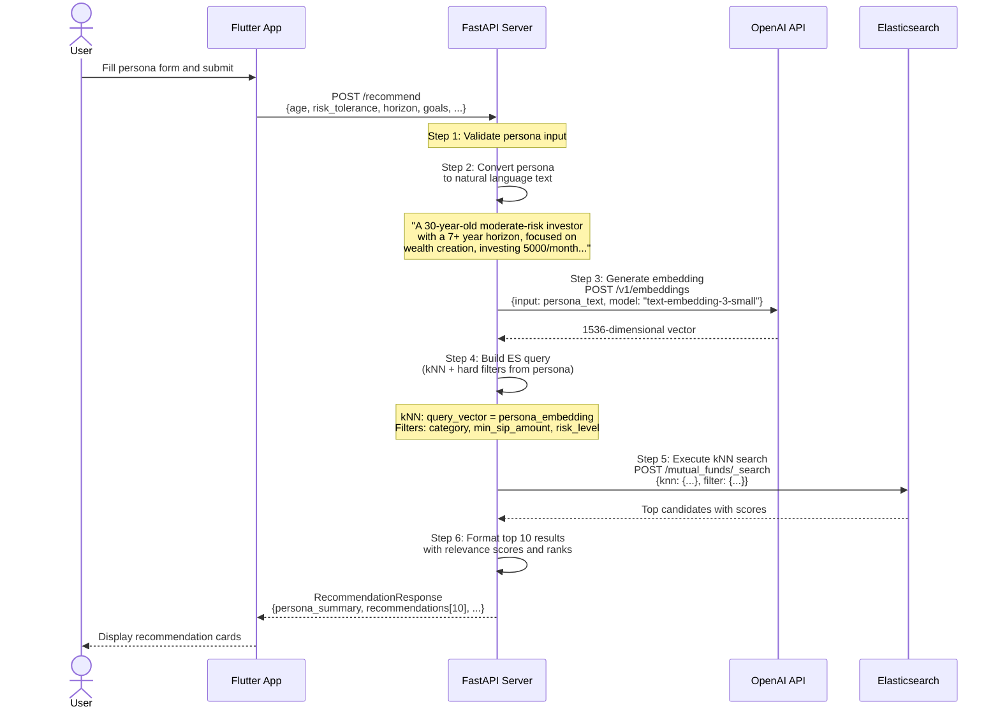
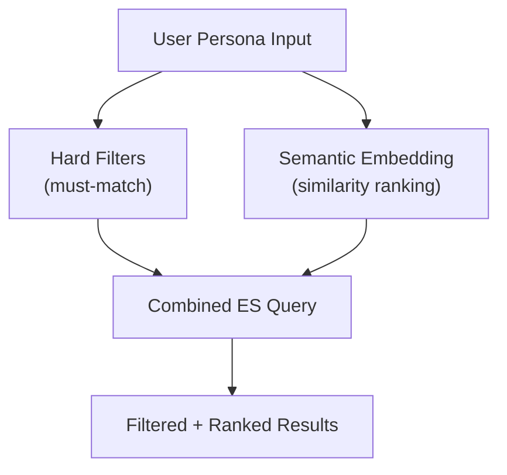
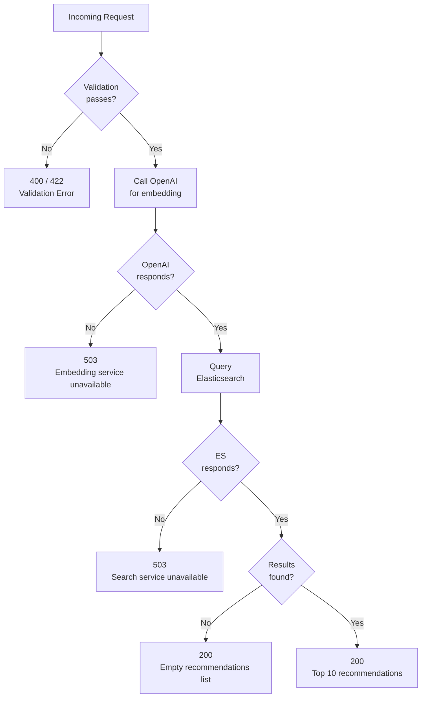

# API Design

## Overview

The FastAPI backend exposes a small, focused set of REST endpoints. The core endpoint is `POST /recommend`, which accepts an investor persona and returns semantically matched mutual fund recommendations using kNN vector search. Supporting endpoints provide fund browsing, detail views, and health monitoring.

**Base URL**: `http://<host>:8000/api/v1`

---

## Endpoints Summary

| Method | Path | Purpose |
|--------|------|---------|
| `POST` | `/recommend` | Get personalized fund recommendations based on investor persona |
| `GET` | `/funds` | Browse all funds with pagination and filtering |
| `GET` | `/funds/{scheme_code}` | Get detailed information for a single fund |
| `GET` | `/health` | Check backend and Elasticsearch connectivity |

---

## POST /recommend

**Purpose**: Accept an investor persona, convert it to a semantic query, and return the top 10 most relevant mutual fund recommendations.

### Request

| Field | Type | Required | Description |
|-------|------|----------|-------------|
| `age` | integer | Yes | Investor age (18-100) |
| `risk_tolerance` | string | Yes | `"low"`, `"moderate"`, or `"high"` |
| `investment_horizon` | string | Yes | `"short"`, `"medium"`, or `"long"` |
| `goals` | list of strings | Yes | At least one goal (e.g., `"retirement"`, `"tax_saving"`, `"wealth_creation"`) |
| `monthly_sip_budget` | float | Yes | Monthly SIP amount in INR (must be greater than 0) |
| `experience_level` | string | Yes | `"beginner"`, `"intermediate"`, or `"advanced"` |
| `preferred_categories` | list of strings | No | Optional category filter (e.g., `["equity", "hybrid"]`) |
| `tax_regime` | string | No | `"old"` or `"new"` |

### Response (200 OK)

| Field | Type | Description |
|-------|------|-------------|
| `persona_summary` | string | Natural language version of the persona (transparency/debugging) |
| `recommendations` | list of ScoredFund | Top 10 funds, ranked by relevance |
| `total_candidates` | integer | Count of funds matching hard filters |
| `model_used` | string | Embedding model used (e.g., `"text-embedding-3-small"`) |

Each `ScoredFund` contains:

| Field | Type | Description |
|-------|------|-------------|
| `rank` | integer | 1-based rank |
| `relevance_score` | float | Cosine similarity score (0.0 to 1.0) |
| `fund` | Fund object | Full fund details (see Data Model doc) |

### Error Responses

| Status | Condition | Body |
|--------|-----------|------|
| 400 | Invalid persona fields (e.g., age out of range) | `{"detail": "age must be between 18 and 100"}` |
| 422 | Missing required fields or wrong types | Standard FastAPI validation error |
| 503 | Elasticsearch unreachable or OpenAI API failure | `{"detail": "Search service unavailable"}` |

---

## GET /funds

**Purpose**: Browse the full fund universe with optional filtering and pagination.

### Query Parameters

| Parameter | Type | Default | Description |
|-----------|------|---------|-------------|
| `page` | integer | 1 | Page number (1-indexed) |
| `page_size` | integer | 20 | Results per page (max 100) |
| `category` | string | None | Filter by category (e.g., `"Equity"`) |
| `sub_category` | string | None | Filter by sub-category (e.g., `"Large Cap"`) |
| `fund_house` | string | None | Filter by AMC name |
| `risk_level` | string | None | Filter by risk level |
| `sort_by` | string | `"scheme_name"` | Sort field: `"scheme_name"`, `"cagr_1y"`, `"cagr_3y"`, `"cagr_5y"`, `"aum_crores"`, `"expense_ratio"` |
| `sort_order` | string | `"asc"` | `"asc"` or `"desc"` |
| `search` | string | None | Free-text search on scheme_name |

### Response (200 OK)

| Field | Type | Description |
|-------|------|-------------|
| `funds` | list of Fund | Fund objects for the current page |
| `total` | integer | Total number of matching funds |
| `page` | integer | Current page number |
| `page_size` | integer | Page size used |
| `total_pages` | integer | Total number of pages |

---

## GET /funds/{scheme_code}

**Purpose**: Retrieve full details for a single fund by its AMFI scheme code.

### Path Parameters

| Parameter | Type | Description |
|-----------|------|-------------|
| `scheme_code` | string | AMFI scheme code (e.g., `"119551"`) |

### Response (200 OK)

Returns a single `Fund` object with all fields (see Data Model doc).

### Error Responses

| Status | Condition | Body |
|--------|-----------|------|
| 404 | Scheme code not found in index | `{"detail": "Fund not found"}` |

---

## GET /health

**Purpose**: Health check endpoint for monitoring and container orchestration.

### Response (200 OK)

| Field | Type | Description |
|-------|------|-------------|
| `status` | string | `"healthy"` or `"degraded"` |
| `elasticsearch` | string | `"connected"` or `"unreachable"` |
| `index_exists` | boolean | Whether the `mutual_funds` index exists |
| `fund_count` | integer | Number of documents in the index |
| `embedding_model` | string | Configured embedding model name |

### Response (503 Service Unavailable)

Returned when Elasticsearch is unreachable:

| Field | Type | Description |
|-------|------|-------------|
| `status` | string | `"unhealthy"` |
| `elasticsearch` | string | `"unreachable"` |
| `detail` | string | Error description |

---

## Recommendation Flow - Sequence Diagram

---

## Filter Logic Table

When a persona is submitted, certain fields are converted into **hard filters** (Elasticsearch term/range queries) that constrain the kNN search space. This ensures recommendations respect the investor's constraints before semantic similarity ranking is applied.

| Persona Field | ES Filter | Logic |
|--------------|-----------|-------|
| `risk_tolerance = "low"` | `risk_level IN ["Low", "Low to Moderate", "Moderate"]` | Exclude high-risk funds for conservative investors |
| `risk_tolerance = "moderate"` | `risk_level IN ["Low to Moderate", "Moderate", "Moderately High"]` | Allow moderate range |
| `risk_tolerance = "high"` | No filter applied | High-risk investors can see all funds |
| `investment_horizon = "short"` | `category IN ["Debt", "Hybrid"]` (if no preferred_categories set) | Short horizon should avoid pure equity |
| `investment_horizon = "long"` | No additional filter | Long horizon suits all categories |
| `monthly_sip_budget` | `min_sip_amount <= monthly_sip_budget` | Only show funds the investor can afford |
| `preferred_categories` (if set) | `category IN [preferred_categories]` | Hard filter to user's explicit preference |
| `goals contains "tax_saving"` | `sub_category = "ELSS"` added as a boost (not hard filter) | ELSS funds get a relevance boost but are not exclusive |
| `experience_level = "beginner"` | Boost funds where `aum_crores > 500` and `fund_age_years > 3` | Prefer established, larger funds for beginners (soft boost) |

### Hard Filters vs Soft Boosts

| Type | Effect | Example |
|------|--------|---------|
| **Hard filter** | Funds not matching are excluded entirely | `min_sip_amount <= budget` |
| **Soft boost** | Matching funds get a score bonus but non-matching are still included | `aum_crores > 500` for beginners |

---

## Request/Response Flow - Error Handling

---

## Rate Limiting and Performance

| Aspect | Detail |
|--------|--------|
| **Expected latency** | 500ms to 1500ms per recommendation request (dominated by OpenAI embedding call ~300-700ms + ES kNN ~50-200ms) |
| **Caching opportunity** | Persona embeddings could be cached for repeated identical queries, but initial version does not implement caching |
| **Concurrent requests** | FastAPI handles concurrent requests natively via async; no special throttling needed for typical mobile app traffic |
| **ES query size** | kNN with `k=50` candidates, post-filtered and limited to top 10 in response |
