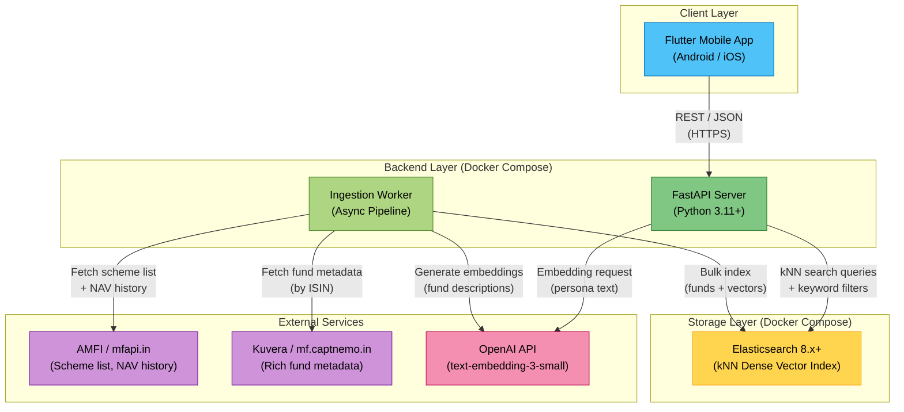
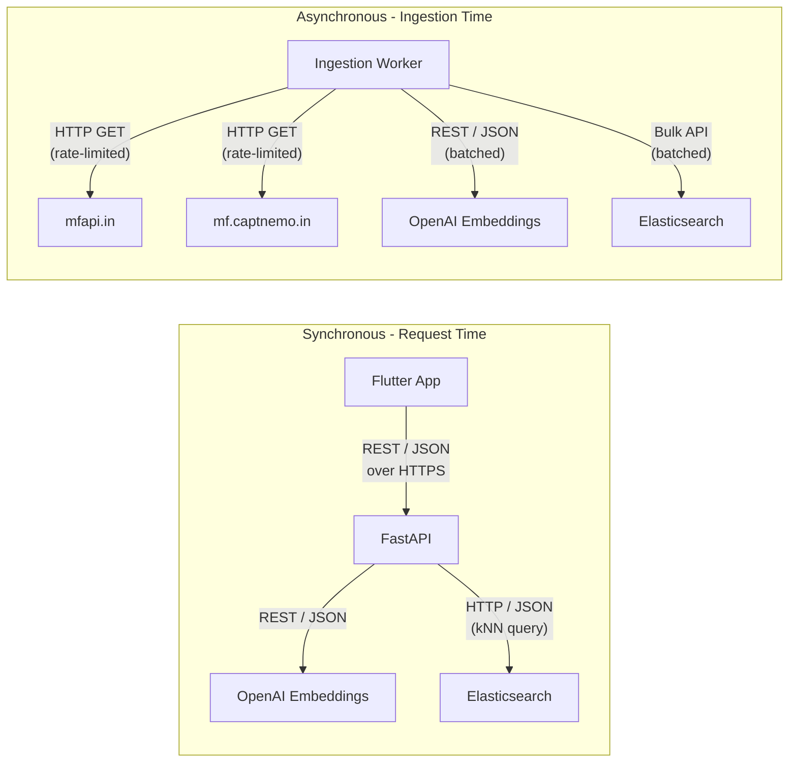
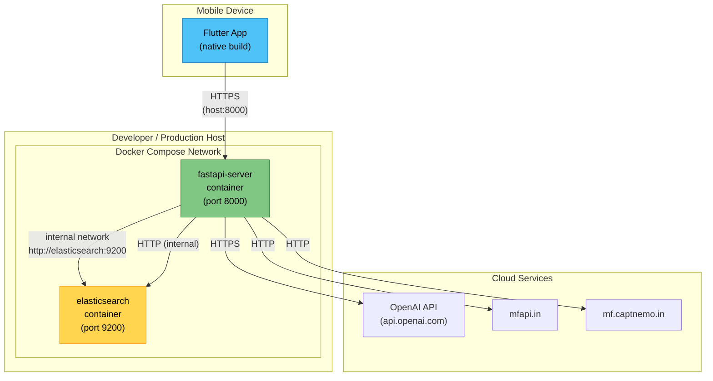

# Architecture Overview

## High-Level System Architecture

The following diagram shows every major component in MF Pasand and the communication paths between them.

---

## Component Responsibilities

### Flutter Mobile App

| Responsibility | Details |
|----------------|---------|
| Persona collection | Multi-step or single-page form capturing investor profile (age, risk tolerance, investment horizon, goals, monthly SIP budget) |
| Recommendation display | Render ranked list of fund cards with key metrics (CAGR, category, expense ratio, risk level) |
| Fund detail view | Full fund information including historical performance, metadata, and category context |
| Network communication | HTTP client calling the FastAPI backend; handles loading, error, and empty states gracefully |

### FastAPI Server

| Responsibility | Details |
|----------------|---------|
| Persona-to-text conversion | Transforms structured persona input into a natural-language paragraph suitable for embedding |
| Embedding generation | Calls OpenAI to generate a 1536-dimensional vector from the persona text |
| Query construction | Builds an Elasticsearch query combining kNN vector similarity with hard filters derived from persona constraints |
| Result formatting | Maps raw Elasticsearch hits to a clean, typed JSON response with relevance scores |
| Health monitoring | Exposes a health endpoint that checks connectivity to Elasticsearch and reports readiness |

### Ingestion Worker

| Responsibility | Details |
|----------------|---------|
| Data fetching | Pulls scheme lists and NAV history from AMFI/mfapi.in; pulls rich metadata from Kuvera/mf.captnemo.in |
| Filtering | Retains only active, open-ended, direct-plan, growth-option schemes (typically 1,500 to 2,500 funds) |
| Data merging | Joins AMFI data (scheme codes, ISINs, NAVs) with Kuvera data (category, sub-category, AMC info, expense ratio, AUM, etc.) using ISIN as the join key |
| Metric computation | Calculates derived performance metrics: 1-year, 3-year, 5-year CAGR; annualized volatility; maximum drawdown |
| Description generation | Converts each fund's structured data into a natural-language paragraph for embedding |
| Embedding generation | Sends fund descriptions to OpenAI in batches and collects 1536-dim vectors |
| Indexing | Bulk-indexes enriched fund documents (with embeddings) into Elasticsearch |

### Elasticsearch 8.x+

| Responsibility | Details |
|----------------|---------|
| Dense vector storage | Stores 1536-dimensional embeddings per fund document using the `dense_vector` field type |
| kNN search | Performs approximate nearest-neighbor search using HNSW algorithm to find semantically similar funds |
| Keyword/numeric filtering | Supports hard filters on category, sub-category, risk level, minimum SIP amount, and other structured fields |
| Combined queries | Handles hybrid queries that apply kNN similarity within a filtered subset of documents |

### External Services

| Service | Role |
|---------|------|
| **mfapi.in** (AMFI) | Provides the canonical list of all mutual fund scheme codes, ISIN mappings (via NAVAll.txt), and daily NAV history per scheme |
| **mf.captnemo.in** (Kuvera) | Provides rich fund metadata: category, sub-category, AMC name, fund manager, expense ratio, AUM, benchmark, minimum investment amounts, exit load, and more |
| **OpenAI API** | Generates text embeddings using `text-embedding-3-small` (1536 dimensions); used both at ingestion time (fund descriptions) and query time (persona text) |

---

## Communication Patterns

### Protocol Details

| Path | Protocol | Format | Pattern |
|------|----------|--------|---------|
| Flutter to FastAPI | HTTPS | JSON | Request-response (REST) |
| FastAPI to OpenAI | HTTPS | JSON | Request-response (single embedding per recommendation call) |
| FastAPI to Elasticsearch | HTTP | JSON | kNN query with filters; response contains scored hits |
| Worker to mfapi.in | HTTP | Text (NAVAll.txt) / JSON | Bulk fetch with asyncio semaphore for rate limiting |
| Worker to mf.captnemo.in | HTTP | JSON | Per-fund fetch with asyncio semaphore for rate limiting |
| Worker to OpenAI | HTTPS | JSON | Batched embedding requests (up to ~2048 texts per call) |
| Worker to Elasticsearch | HTTP | JSON | Bulk index API for batch document ingestion |

---

## Deployment Topology

### Docker Compose Services

| Service | Image | Ports | Volumes | Notes |
|---------|-------|-------|---------|-------|
| `fastapi-server` | Custom Dockerfile (Python 3.11 + FastAPI + httpx) | `8000:8000` | None (stateless) | Runs both the API server and the ingestion worker; the worker is triggered via a CLI command or startup hook |
| `elasticsearch` | `docker.elastic.co/elasticsearch/elasticsearch:8.x` | `9200:9200` | Named volume for data persistence | Single-node mode; security disabled for local dev; `xpack.security.enabled=false` |

### Environment Variables

| Variable | Service | Purpose |
|----------|---------|---------|
| `OPENAI_API_KEY` | fastapi-server | Authenticates with OpenAI for embedding generation |
| `ELASTICSEARCH_URL` | fastapi-server | Connection string for Elasticsearch (default: `http://elasticsearch:9200`) |
| `EMBEDDING_MODEL` | fastapi-server | Model identifier (default: `text-embedding-3-small`); swappable to any OpenAI-compatible model |
| `EMBEDDING_DIMENSIONS` | fastapi-server | Vector dimensions (default: `1536`); must match the model output |

### Scaling Considerations

- **Elasticsearch**: For production, move to a managed Elasticsearch cluster (Elastic Cloud, AWS OpenSearch) with multiple nodes and replicas.
- **FastAPI**: Stateless; can be horizontally scaled behind a load balancer. Each instance connects to the shared Elasticsearch cluster.
- **Ingestion Worker**: Runs as a one-off or scheduled job. Only one instance should run at a time to avoid duplicate indexing.
- **Flutter App**: Distributed via App Store / Play Store. Communicates with the backend via a configurable base URL.
