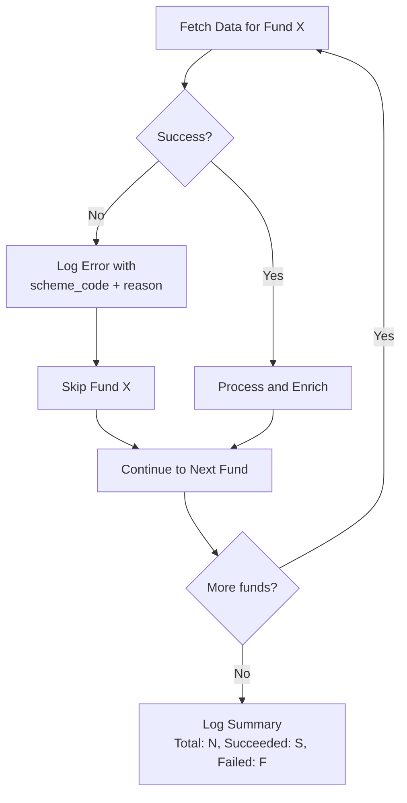
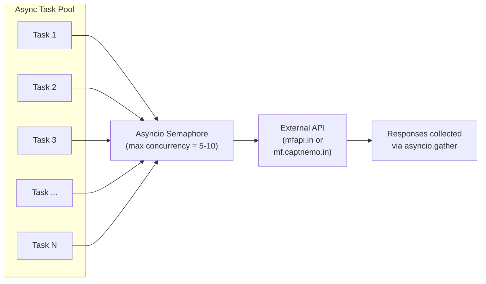

# Data Ingestion Pipeline

## Overview

The ingestion pipeline is responsible for collecting mutual fund data from two external sources (AMFI and Kuvera), merging and enriching the data, computing performance metrics, generating vector embeddings, and bulk-indexing everything into Elasticsearch. The pipeline is designed to be **resilient** -- individual fund failures are logged and skipped so the overall run completes successfully.

---

## End-to-End Pipeline Flowchart

```mermaid
flowchart TD
    START(["Pipeline Start"]) --> S1

    S1["Step 1: Fetch AMFI Master Data<br/>(NAVAll.txt)<br/>Build scheme_code - ISIN mapping"] --> S2

    S2["Step 2: Fetch All Scheme Codes<br/>from mfapi.in"] --> S3

    S3["Step 3: Filter Schemes<br/>Keep only:<br/>- Active status<br/>- Open-ended type<br/>- Direct plan<br/>- Growth option<br/>(~1,500 to 2,500 funds)"] --> S4

    S4["Step 4: Fetch NAV History<br/>per fund from mfapi.in<br/>(rate-limited, async)"] --> S5

    S5["Step 5: Fetch Rich Metadata<br/>per fund from mf.captnemo.in<br/>using ISIN lookup<br/>(rate-limited, async)"] --> S6

    S6["Step 6: Merge AMFI + Kuvera Data<br/>Join on ISIN as primary key"] --> S7

    S7["Step 7: Compute Derived Metrics<br/>1Y / 3Y / 5Y CAGR<br/>Annualized Volatility<br/>Maximum Drawdown"] --> S8

    S8["Step 8: Generate Natural Language<br/>Fund Descriptions<br/>(template-based conversion)"] --> S9

    S9["Step 9: Generate Embeddings<br/>via OpenAI API<br/>(batched requests)"] --> S10

    S10["Step 10: Bulk Index into<br/>Elasticsearch<br/>(create/replace index)"] --> DONE

    DONE(["Pipeline Complete"])

    style START fill:#4FC3F7,stroke:#0277BD,color:#000
    style DONE fill:#81C784,stroke:#2E7D32,color:#000
    style S3 fill:#FFF9C4,stroke:#F9A825,color:#000
    style S6 fill:#FFF9C4,stroke:#F9A825,color:#000
    style S9 fill:#F8BBD0,stroke:#C2185B,color:#000
```



---

## Step-by-Step Details

### Step 1: Fetch AMFI Master Data

- **Source**: `https://www.amfiindia.com/spages/NAVAll.txt` (also mirrored via mfapi.in)
- **Purpose**: This flat file contains every mutual fund scheme registered with AMFI, including scheme codes and ISIN numbers (ISIN Div Payout/Growth, ISIN Div Reinvestment)
- **Output**: A lookup dictionary mapping `scheme_code` to `ISIN` (growth ISIN preferred)
- **Why needed**: mfapi.in uses scheme codes but does not provide ISINs in its API responses; Kuvera uses ISINs as identifiers. This mapping is the bridge between the two data sources.

### Step 2: Fetch All Scheme Codes

- **Source**: `https://api.mfapi.in/mf` (returns a JSON array of all scheme codes and names)
- **Output**: Complete list of scheme codes with scheme names
- **Volume**: Approximately 45,000+ entries (includes all plan types, options, and closed schemes)

### Step 3: Filter to Target Universe

The raw list is filtered down to the target universe using scheme name heuristics:

| Filter Criterion | Rationale |
|-----------------|-----------|
| **Direct plan** | Lower expense ratios; name contains "Direct" |
| **Growth option** | Capital appreciation focus; name contains "Growth" |
| **Open-ended** | Liquid and accessible; excludes closed-end, interval, and FMP schemes |
| **Active / not wound up** | Only currently investable schemes |

- **Output**: A filtered list of approximately 1,500 to 2,500 scheme codes
- **Heuristic**: Filtering is based on scheme name pattern matching since AMFI does not provide structured plan/option fields in the API

### Step 4: Fetch NAV History

- **Source**: `https://api.mfapi.in/mf/{scheme_code}` per fund
- **Output**: For each fund, a time series of daily NAV values with dates
- **Used for**: Computing performance metrics (CAGR, volatility, max drawdown)
- **Rate limiting**: Controlled via asyncio semaphore (see Rate Limiting Strategy below)

### Step 5: Fetch Rich Metadata from Kuvera

- **Source**: `https://mf.captnemo.in/ISIN/{isin}` per fund
- **Output**: Structured metadata including category, sub-category, AMC name, fund manager, expense ratio, AUM, benchmark index, minimum investment amounts, exit load details, and more
- **Lookup key**: ISIN obtained from the Step 1 mapping
- **Fallback**: If a fund's ISIN is not found in the mapping or Kuvera returns no data, the fund proceeds with AMFI-only data (partial enrichment)

### Step 6: Merge AMFI and Kuvera Data

See the dedicated Merge Strategy section below for the sequence diagram.

- **Join key**: ISIN (derived from scheme_code via Step 1 mapping)
- **Conflict resolution**: Kuvera data takes precedence for overlapping fields (e.g., fund name, category) since it is more structured
- **Missing data**: Fields not available from either source are set to null

### Step 7: Compute Derived Metrics

From the NAV time series, the following metrics are computed:

| Metric | Computation | Notes |
|--------|-------------|-------|
| **1-Year CAGR** | `(latest_NAV / NAV_1yr_ago) - 1` | Requires at least 1 year of NAV data |
| **3-Year CAGR** | `(latest_NAV / NAV_3yr_ago)^(1/3) - 1` | Requires at least 3 years of NAV data |
| **5-Year CAGR** | `(latest_NAV / NAV_5yr_ago)^(1/5) - 1` | Requires at least 5 years of NAV data |
| **Annualized Volatility** | Standard deviation of daily log returns, annualized (x sqrt(252)) | Computed over all available NAV history |
| **Maximum Drawdown** | Largest peak-to-trough decline in NAV over the full history | Expressed as a percentage |

- **Handling insufficient data**: If a fund lacks enough NAV history for a given metric (e.g., a fund launched 2 years ago cannot have a 5Y CAGR), that field is set to null rather than estimated.

### Step 8: Generate Natural Language Descriptions

Each fund's structured data is converted into a natural-language paragraph using a template. This paragraph becomes the input for embedding generation.

**Template approach**: A deterministic template that weaves together the fund's key attributes into readable prose. Example structure (not code):

> "[Fund Name] is a [category] mutual fund managed by [AMC]. It follows a [sub-category] strategy with a [risk level] risk profile. Over the past year it has delivered [1Y CAGR]% returns, with [3Y CAGR]% over three years and [5Y CAGR]% over five years. The fund has an expense ratio of [expense_ratio]% and manages [AUM] crores in assets. The minimum SIP investment is [min_sip]. It benchmarks against [benchmark_index]."

- Null fields are gracefully omitted from the description rather than rendered as placeholders
- The description is optimized for semantic similarity matching -- it emphasizes investment style, risk, returns, and suitability

### Step 9: Generate Embeddings

- **Model**: `text-embedding-3-small` (1536 dimensions) via OpenAI API
- **Batching**: Descriptions are sent in batches (OpenAI supports up to 2048 inputs per request) to minimize API calls
- **Output**: One 1536-dimensional float vector per fund
- **Swappability**: The embedding model is configurable via environment variable; changing the model requires a full re-ingestion

### Step 10: Bulk Index into Elasticsearch

- **Strategy**: Drop and recreate the index on each full ingestion run (ensures clean state)
- **API**: Elasticsearch Bulk API for efficient batch indexing
- **Batch size**: Documents are indexed in batches of 200-500 to balance memory usage and throughput
- **Document ID**: `scheme_code` is used as the Elasticsearch document `_id` for deterministic upserts

---

## Merge Strategy - Sequence Diagram

```mermaid
sequenceDiagram
    participant W as Ingestion Worker
    participant AMFI as mfapi.in
    participant MAP as ISIN Mapping<br/>(from NAVAll.txt)
    participant KUV as mf.captnemo.in
    participant MERGE as Merged Fund Record

    W->>AMFI: GET /mf/{scheme_code}
    AMFI-->>W: NAV history + scheme name

    W->>MAP: Lookup ISIN for scheme_code
    MAP-->>W: ISIN (or null if not found)

    alt ISIN found
        W->>KUV: GET /ISIN/{isin}
        KUV-->>W: Rich metadata (category, AMC, expense ratio, AUM, ...)

        W->>MERGE: Combine AMFI data + Kuvera data
        Note over MERGE: Kuvera fields take precedence<br/>for overlapping attributes<br/>(fund name, category)
        Note over MERGE: AMFI provides: scheme_code,<br/>NAV history, ISIN mapping
        Note over MERGE: Kuvera provides: category,<br/>sub-category, AMC, fund manager,<br/>expense ratio, AUM, benchmark,<br/>min SIP, exit load
    else ISIN not found
        W->>MERGE: Use AMFI data only (partial record)
        Note over MERGE: Category and metadata fields<br/>will be null; fund still indexed<br/>with NAV-derived metrics
    end

    W->>MERGE: Attach computed metrics<br/>(CAGR, volatility, drawdown)
    W->>MERGE: Generate natural language description
    MERGE-->>W: Complete fund document ready for embedding
```

---

## Error Handling Strategy

The pipeline follows a **resilient, skip-and-continue** approach. No single fund failure should halt the entire ingestion run.



| Error Scenario | Handling |
|---------------|----------|
| mfapi.in returns HTTP error for a scheme | Log warning, skip that fund, continue with next |
| mf.captnemo.in returns 404 for an ISIN | Log info (expected for some funds), proceed with AMFI-only data |
| ISIN not found in NAVAll.txt mapping | Log info, proceed with AMFI-only data (no Kuvera enrichment) |
| NAV history too short for metric computation | Set affected metric fields to null, still index the fund |
| OpenAI embedding request fails for a batch | Retry once with exponential backoff; if still failing, log error and skip that batch |
| Elasticsearch bulk index partial failure | Log failed document IDs, continue; summary reports total indexed vs failed |
| NAVAll.txt fetch fails entirely | Abort pipeline -- this mapping is critical for the ISIN bridge |
| mfapi.in scheme list fetch fails entirely | Abort pipeline -- cannot proceed without the scheme universe |

---

## Rate Limiting Strategy

External APIs are free, community-maintained services. Aggressive request rates could overload them or trigger IP bans. The pipeline uses **asyncio with httpx and a semaphore** to control concurrency.



| Parameter | Value | Rationale |
|-----------|-------|-----------|
| **Max concurrent requests** (semaphore) | 5-10 | Polite rate for community APIs; avoids overwhelming the server |
| **Delay between batches** | 100-200ms | Additional breathing room between request waves |
| **HTTP timeout per request** | 30 seconds | Long enough for slow responses; prevents indefinite hangs |
| **Retry on 429 / 5xx** | Up to 3 retries with exponential backoff (1s, 2s, 4s) | Handles transient rate limits and server errors |
| **HTTP client** | httpx (async) | Native asyncio support, connection pooling, HTTP/2 capable |
| **OpenAI rate limiting** | Respects API rate limits; batches of ~100 descriptions per request | Stays well within OpenAI tier limits |

---

## Pipeline Execution Summary

```mermaid
gantt
    title Ingestion Pipeline - Approximate Timeline
    dateFormat  HH:mm
    axisFormat  %H:%M

    section Data Fetching
    Fetch NAVAll.txt + scheme list     :fetch1, 00:00, 2min
    Filter to target universe          :filter, after fetch1, 1min
    Fetch NAV history (async)          :nav, after filter, 15min
    Fetch Kuvera metadata (async)      :kuv, after filter, 10min

    section Processing
    Merge AMFI + Kuvera data           :merge, after nav kuv, 2min
    Compute derived metrics            :metrics, after merge, 3min
    Generate descriptions              :desc, after metrics, 1min

    section Embedding + Indexing
    Generate embeddings (batched)      :embed, after desc, 5min
    Bulk index into Elasticsearch      :index, after embed, 2min
```



**Total estimated pipeline duration**: 30-45 minutes for a full run of ~2,000 funds, depending on network conditions and API response times.

**Recommended schedule**: Run once daily (e.g., after market close at 6:00 PM IST) to capture updated NAVs. Can also be triggered manually for ad-hoc refreshes.
