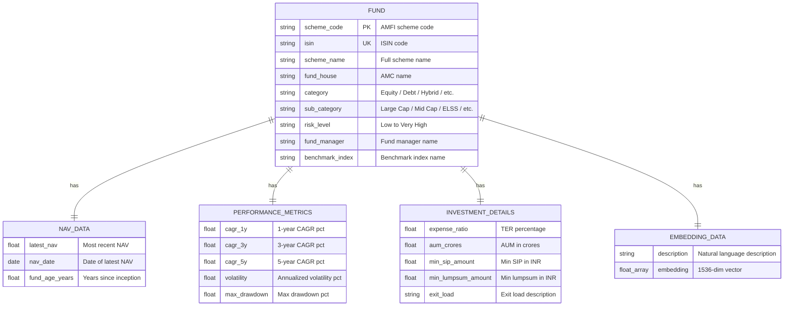
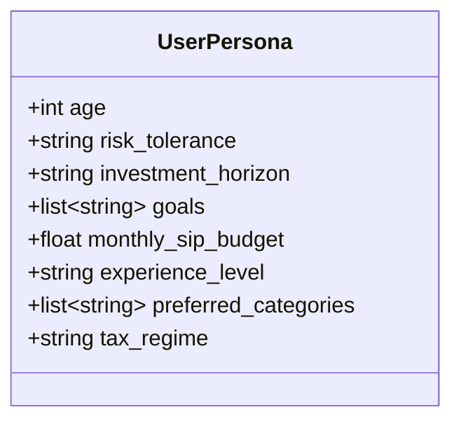
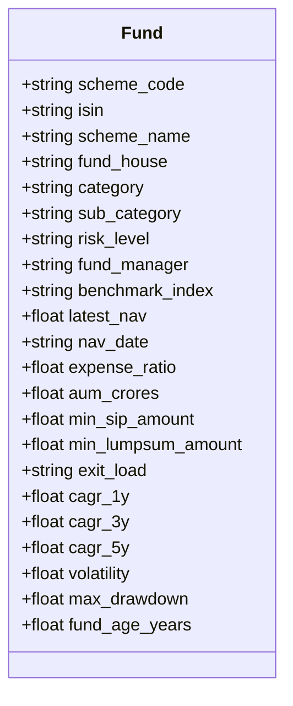
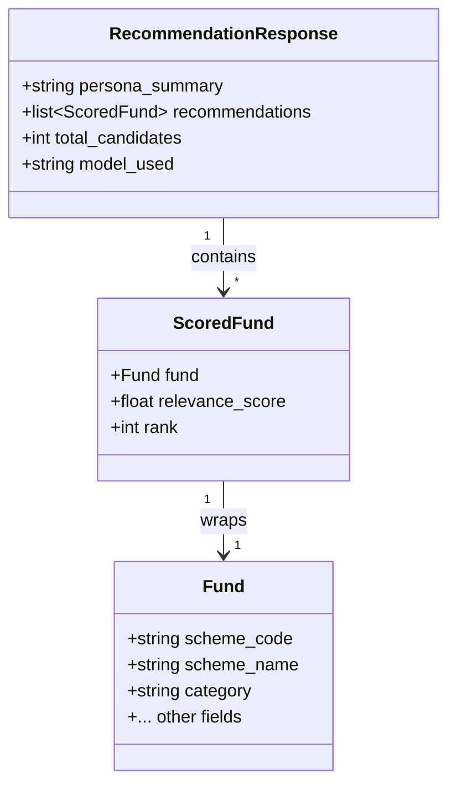
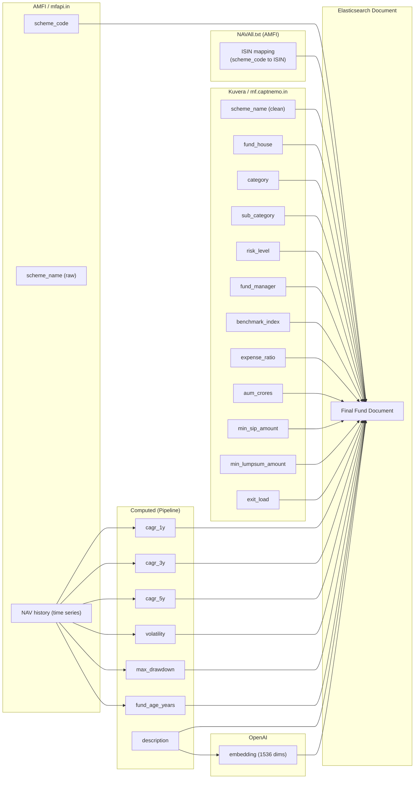

# Data Model

## Overview

The data model centers on a single Elasticsearch index (`mutual_funds`) that stores enriched fund documents with dense vector embeddings. This document describes the index mapping, the fund data model, the Pydantic request/response schemas, and how data from AMFI and Kuvera maps to the final schema.

---

## Elasticsearch Index Mapping

The `mutual_funds` index uses the following field types:

| Field | ES Type | Purpose |
|-------|---------|---------|
| `scheme_code` | `keyword` | Unique AMFI scheme identifier; used as document `_id` |
| `isin` | `keyword` | ISIN code for cross-referencing with Kuvera |
| `scheme_name` | `text` | Full scheme name (searchable) |
| `fund_house` | `keyword` | AMC / fund house name (filterable) |
| `category` | `keyword` | Broad category: Equity, Debt, Hybrid, Solution Oriented, Other |
| `sub_category` | `keyword` | SEBI sub-category: Large Cap, Mid Cap, Small Cap, ELSS, etc. |
| `risk_level` | `keyword` | Riskometer value: Low, Low to Moderate, Moderate, Moderately High, High, Very High |
| `fund_manager` | `keyword` | Name of the fund manager |
| `benchmark_index` | `keyword` | Benchmark index name |
| `latest_nav` | `float` | Most recent NAV value |
| `nav_date` | `date` | Date of the latest NAV |
| `expense_ratio` | `float` | Total expense ratio (percentage) |
| `aum_crores` | `float` | Assets under management in crores |
| `min_sip_amount` | `float` | Minimum SIP investment amount in INR |
| `min_lumpsum_amount` | `float` | Minimum lump sum investment in INR |
| `exit_load` | `text` | Exit load description (free text) |
| `cagr_1y` | `float` | 1-year CAGR (percentage, nullable) |
| `cagr_3y` | `float` | 3-year CAGR (percentage, nullable) |
| `cagr_5y` | `float` | 5-year CAGR (percentage, nullable) |
| `volatility` | `float` | Annualized volatility (percentage) |
| `max_drawdown` | `float` | Maximum drawdown (percentage, negative value) |
| `fund_age_years` | `float` | Years since fund inception |
| `description` | `text` | Natural language description used for embedding |
| `embedding` | `dense_vector` (1536 dims, cosine similarity) | Vector embedding of the fund description |

### Dense Vector Configuration

```
Field: embedding
Type: dense_vector
Dimensions: 1536
Similarity: cosine
Index: true (enables kNN search)
Algorithm: HNSW (default in ES 8.x+)
  - m: 16
  - ef_construction: 100
```

---

## Fund Data Model - ER Diagram



> Note: In Elasticsearch, these are all fields in a single flat document, not separate tables. The ER diagram groups them logically for clarity.

---

## Pydantic Models

### UserPersona (Request Input)

The persona captures the investor's profile and preferences to drive personalized recommendations.



| Field | Type | Constraints | Description |
|-------|------|------------|-------------|
| `age` | integer | 18 to 100 | Investor's age; influences risk and horizon recommendations |
| `risk_tolerance` | string (enum) | `"low"`, `"moderate"`, `"high"` | Self-assessed risk appetite |
| `investment_horizon` | string (enum) | `"short"` (less than 3Y), `"medium"` (3-7Y), `"long"` (7Y+) | Planned holding period |
| `goals` | list of strings | At least 1 required; values like `"retirement"`, `"wealth_creation"`, `"tax_saving"`, `"emergency_fund"`, `"child_education"`, `"house_purchase"` | Financial goals driving the investment |
| `monthly_sip_budget` | float | Greater than 0 | Monthly SIP amount the investor can commit (INR) |
| `experience_level` | string (enum) | `"beginner"`, `"intermediate"`, `"advanced"` | Investing experience; influences fund complexity in recommendations |
| `preferred_categories` | list of strings | Optional; values like `"equity"`, `"debt"`, `"hybrid"` | Category preferences (if any); used as hard filters |
| `tax_regime` | string (enum) | Optional; `"old"`, `"new"` | Tax regime; influences ELSS recommendation relevance |

### Fund (Response Object)



| Field | Nullable | Notes |
|-------|----------|-------|
| `scheme_code` | No | Always present |
| `isin` | Yes | May be null if ISIN mapping not found |
| `scheme_name` | No | Always present from AMFI |
| `fund_house` | Yes | From Kuvera; null if not enriched |
| `category` | Yes | From Kuvera; null if not enriched |
| `sub_category` | Yes | From Kuvera; null if not enriched |
| `risk_level` | Yes | From Kuvera; null if not enriched |
| `cagr_1y`, `cagr_3y`, `cagr_5y` | Yes | Null if insufficient NAV history |
| `volatility`, `max_drawdown` | Yes | Null if insufficient NAV history |
| All other fields | Yes | Dependent on data source availability |

### RecommendationResponse (API Response)



| Field | Type | Description |
|-------|------|-------------|
| `persona_summary` | string | The natural language text generated from the persona (useful for debugging/transparency) |
| `recommendations` | list of ScoredFund | Top 10 recommended funds, ordered by relevance score (descending) |
| `total_candidates` | integer | Total number of funds that matched the hard filters before kNN ranking |
| `model_used` | string | Embedding model identifier used for this recommendation (e.g., `text-embedding-3-small`) |

---

## Data Source Mapping

The following diagram shows which fields come from which data source and how they combine into the final Elasticsearch document.



### Field Precedence Rules

| Scenario | Rule |
|----------|------|
| Both AMFI and Kuvera provide `scheme_name` | Use Kuvera's version (cleaner formatting) |
| Kuvera data unavailable for a fund | Use AMFI data only; Kuvera-sourced fields are null |
| NAV history too short for a metric | Set that metric to null; other metrics still computed |
| ISIN mapping not found | Skip Kuvera enrichment entirely; log and continue |
| Fund has no NAV data at all | Skip the fund entirely (cannot compute any useful data) |
