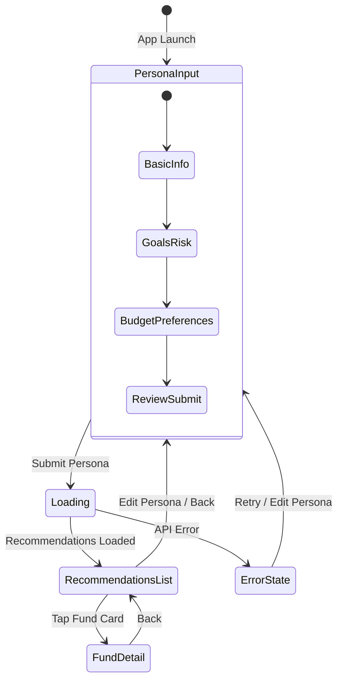
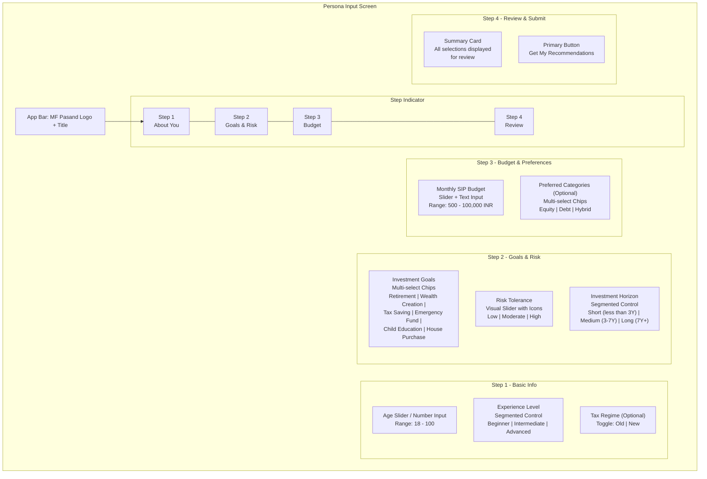
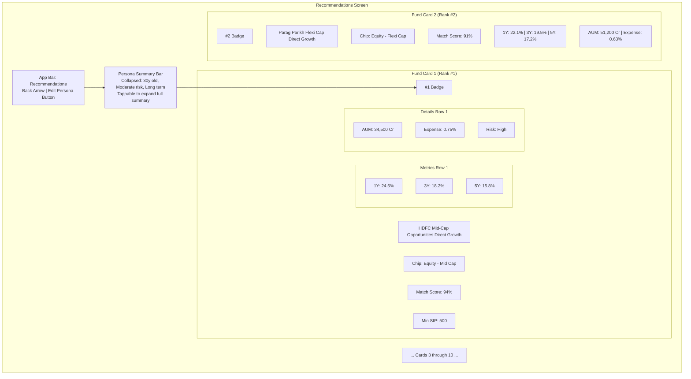
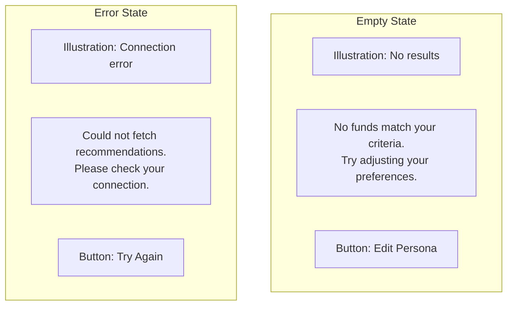
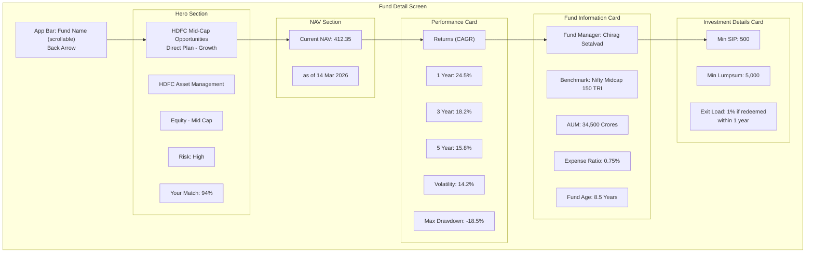
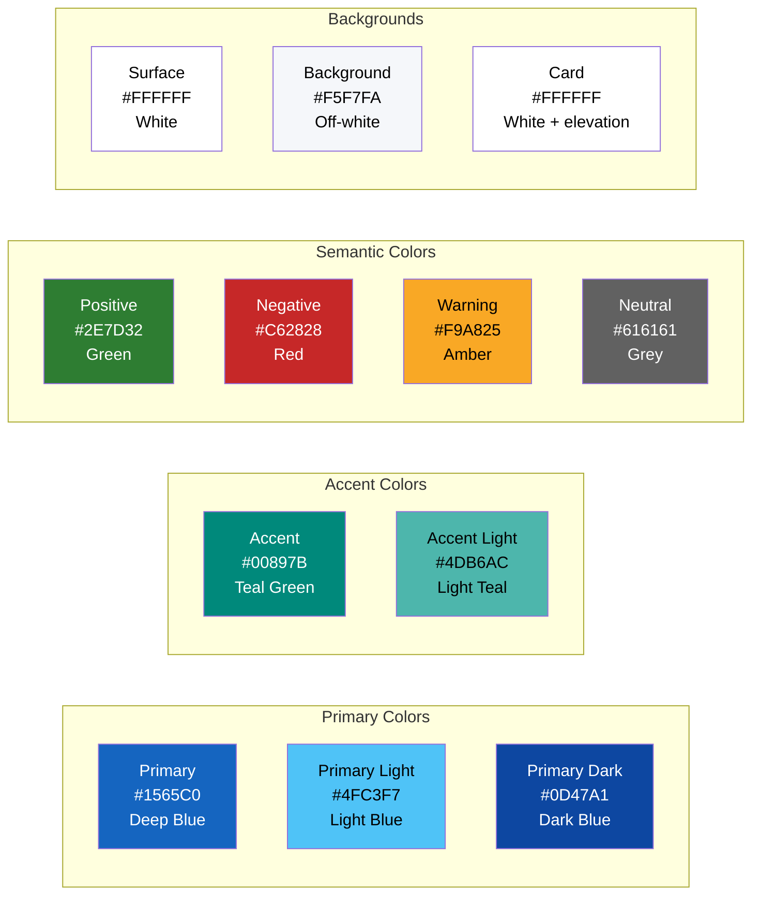
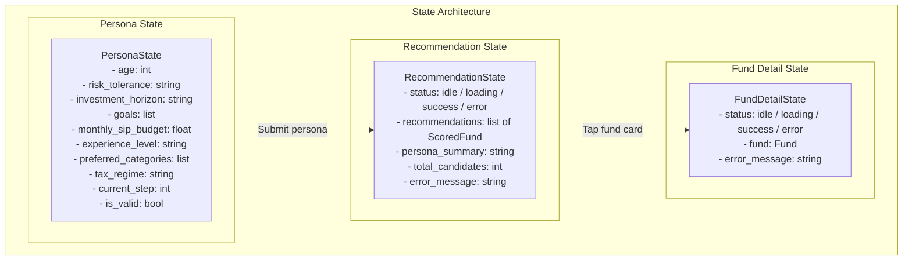
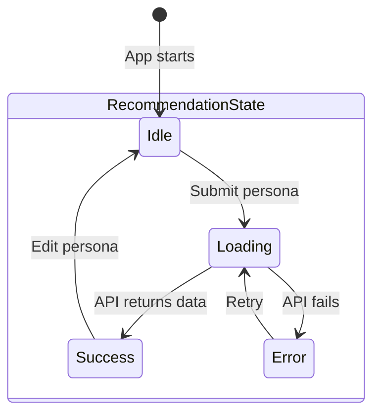
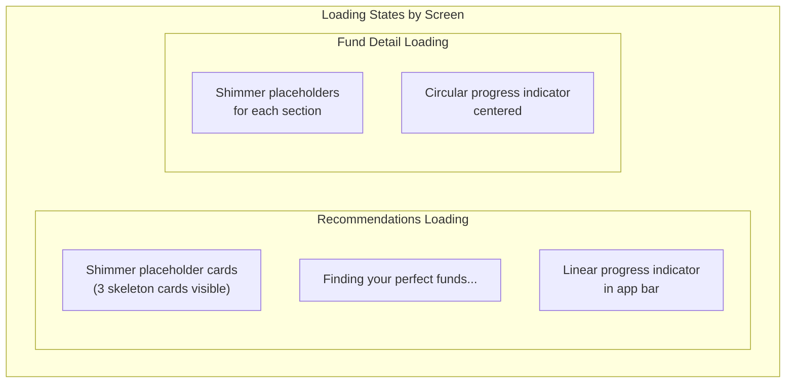

# Frontend Design

## Overview

The MF Pasand mobile app is built with **Flutter**, targeting both Android and iOS with a single codebase. The app follows a mobile-first design philosophy with a calming, trustworthy aesthetic inspired by Indian fintech apps like Kuvera and Groww. The interface is intentionally simple: three screens guide the user from persona input to personalized recommendations to detailed fund exploration.

---

## Screen Flow / Navigation

### Navigation Rules

| From | To | Trigger | Transition |
|------|----|---------|------------|
| Persona Input | Loading | User taps "Get Recommendations" | Push with loading overlay |
| Loading | Recommendations List | API responds successfully | Replace loading with results |
| Loading | Error State | API returns error or timeout | Show error with retry option |
| Recommendations List | Fund Detail | User taps a fund card | Push detail screen |
| Fund Detail | Recommendations List | User taps back / swipe back | Pop |
| Recommendations List | Persona Input | User taps "Edit Persona" | Pop to root |
| Error State | Persona Input | User taps "Try Again" | Pop to persona form |

---

## Screen 1: Persona Input Form

### Layout

### Interaction Details

| Element | Type | Behavior |
|---------|------|----------|
| Age | Slider with numeric input | Defaults to 30; slider range 18-100; user can also type directly |
| Experience Level | Segmented control (3 options) | Single select; defaults to "Beginner" |
| Tax Regime | Optional toggle | Defaults to unselected; informational tooltip explains relevance |
| Goals | Chip group | Multi-select; at least one required; chips highlight on selection |
| Risk Tolerance | Custom slider with emoji/icon indicators | Three stops; visual feedback (green for low, yellow for moderate, red for high) |
| Investment Horizon | Segmented control | Single select; shows years range below each option |
| Monthly SIP Budget | Slider + editable text field | Slider for quick selection; text field for precise input; minimum 500 INR |
| Preferred Categories | Chip group | Optional multi-select; if none selected, all categories are considered |
| Review card | Read-only summary | Shows all selections; each row is tappable to jump back to that step |
| Submit button | Elevated button | Disabled until all required fields are filled; shows loading spinner on tap |

### Step Navigation

- Users can swipe between steps or tap the step indicator
- Back button returns to the previous step (or exits app from Step 1)
- Each step validates its inputs before allowing forward navigation
- The step indicator shows completion state (filled dot for completed, outlined for current, dimmed for future)

---

## Screen 2: Recommendations List

### Layout

### Card Design Details

| Element | Visual Treatment |
|---------|-----------------|
| Rank badge | Circular badge, top-left of card; gold for #1, silver for #2, bronze for #3, neutral for #4-#10 |
| Fund name | Bold, primary text; truncated with ellipsis if too long |
| Category chip | Small colored chip (green for Equity, blue for Debt, purple for Hybrid) |
| Match score | Prominent percentage; color-coded (green above 80%, yellow 60-80%, neutral below 60%) |
| CAGR values | Three columns; green for positive, red for negative; "N/A" for null values |
| AUM and Expense ratio | Secondary text row; compact format |
| Risk level | Color-coded text (green/yellow/red) |
| Min SIP | Shown only if relevant; format: "SIP from 500" |
| Card itself | Elevated card with subtle shadow; rounded corners (12dp); tappable with ripple effect |

### Empty and Error States

---

## Screen 3: Fund Detail

### Layout

### Section Details

| Section | Content | Visual Notes |
|---------|---------|--------------|
| Hero | Fund name, AMC, category chip, risk badge, match score | Large text; category and risk as colored chips; match score in a circular progress indicator |
| NAV | Current NAV value and date | Prominent number; date in secondary text |
| Performance | CAGR values, volatility, max drawdown | Bar chart or horizontal indicators showing relative performance; green/red color coding |
| Fund Information | Manager, benchmark, AUM, expense ratio, age | Clean key-value layout; each row with icon + label + value |
| Investment Details | Min SIP, min lumpsum, exit load | Card with investment-relevant info; exit load as expandable text if lengthy |

---

## Design Guidelines

### Color Palette

### Design System

| Aspect | Guideline |
|--------|-----------|
| **Framework** | Material 3 (Material You) |
| **Typography** | Google Fonts - Inter or Poppins; headings in semi-bold, body in regular |
| **Spacing** | 8dp grid system; consistent padding (16dp horizontal, 12dp vertical for cards) |
| **Border radius** | 12dp for cards, 8dp for chips and buttons, 24dp for FABs |
| **Elevation** | Cards: 1-2dp elevation; bottom sheets: 8dp; dialogs: 16dp |
| **Icons** | Material Symbols (outlined style); consistent 24dp size |
| **Aesthetic** | Calming blue/green palette; clean whitespace; inspired by Kuvera and Groww |
| **Dark mode** | Planned for future; initial release is light mode only |

### Accessibility

| Aspect | Guideline |
|--------|-----------|
| Contrast ratio | Minimum 4.5:1 for body text, 3:1 for large text (WCAG AA) |
| Touch targets | Minimum 48dp x 48dp for all interactive elements |
| Screen reader | All interactive elements have semantic labels |
| Font scaling | Supports system font size preferences; layout adapts without overflow |

---

## State Management

### State Management Approach

| Aspect | Decision | Rationale |
|--------|----------|-----------|
| **Library** | Provider or Riverpod | Lightweight, Flutter-native, sufficient for 3-screen app |
| **Pattern** | ChangeNotifier + Consumer (Provider) or StateNotifier (Riverpod) | Simple, testable, well-documented |
| **API layer** | Repository pattern with a single ApiClient | Centralized HTTP logic; easy to mock for testing |
| **State persistence** | None (in-memory only) | App is lightweight; persona can be re-entered quickly |

### State Transitions

---

## Loading States

| Screen | Loading Indicator | Behavior |
|--------|-------------------|----------|
| Persona Submit | Button shows circular spinner; form fields disabled | Prevents double submission |
| Recommendations List | 3 shimmer skeleton cards + "Finding your perfect funds..." text | Communicates progress; skeleton matches card layout |
| Fund Detail | Section-level shimmer placeholders | Each card section shows its shimmer independently |

---

## Error Handling UX

| Error Type | User-Facing Message | Action Offered |
|------------|---------------------|----------------|
| Network error (no internet) | "No internet connection. Please check your network and try again." | "Try Again" button |
| Server error (5xx) | "Something went wrong on our end. Please try again in a moment." | "Try Again" button |
| Timeout | "The request took too long. Please try again." | "Try Again" button |
| No results (empty recommendations) | "No funds match your criteria. Try adjusting your risk tolerance or budget." | "Edit Preferences" button |
| Invalid input (client-side validation) | Inline error message below the specific field | Field highlights in red; message in error color |

### Error Display Pattern

- **Inline errors** (validation): Shown directly below the offending input field; field border turns red
- **Full-screen errors** (network/server): Centered illustration + message + action button; replaces content area
- **Snackbar errors** (non-critical): Bottom snackbar for transient issues (e.g., "Could not load fund details, showing cached data")
- **No toast messages**: Avoid toasts as they are easy to miss on mobile; prefer persistent error states
